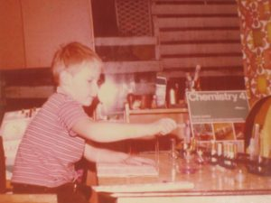

## View from the Code Face

**View From the Code Face** is a software development blog by me, Alan Mellor.

I want to do two things:

- Tell **_stories_** about real world projects. This is how humans have always passed on knowledge
- Present **_tutorials_**, to help beginners understand how commercial developers work

## Elsewhere on the Web

- [Alan Mellor on Linked In](https://www.linkedin.com/in/alan-mellor-15177927/)
- [Alan Mellor on Quora](https://www.quora.com/profile/Alan-Mellor)

## About Me

I was the archetypal nerd kid - but sadly, before that was cool!

I had Electronics and Chemistry sets instead of a football. It was probably obvious I would get into computing.

That said, I came at it from a [slightly different angle](https://www.viewfromthecodeface.com/piece-code-really-got-started/): Film-making. I loved making clay animation on 8mm film. And then I saw Space Invaders: Animation where _you controlled the script_. That was it. I wanted to make my own computer games. I _had to_. And I did, using Z80 assembler, on a Sinclair ZX81 computer with 1k RAM.

## Projects

Since then, I've worked on a lot of interesting projects (and, mercifully, better hardware):

- The RAF Red Arrows flight simulator
- Fun School 2 educational games
- Siemens [Optical Line Termination Equipment](https://www.viewfromthecodeface.com/combining-disciplines-solve-hard-problems/)
- Siemens MicroMaster drives and RS485, Profibus networking
- Siemens Travelling Wave Tube based Satellite Communications systems
- The 3D real time PC 'Sims' game 'Autocracy'
- Ericsson R380s - The world's first smartphone
- Bounce - Nokia's popular game
- Document Warehousing systems
- Printer fleet management system
- Yuuguu's Web Conferencing SaaS product
- High volume Used Car retailer websites with AutoTrader UK
- Created the online church guitarist course www.learnrockworshipguitar.com
- An MPT1345 compliant VHF guitar radio link - a fun final year project at University

 

I'm [self-taught](https://www.viewfromthecodeface.com/learn-basics-programming-language-quickly/) in terms of software, with the help of many books, blogs and people kind enough to share their knowledge with me.

I have a 2.1 B.Eng(Hons) in Electronic Engineering from Salford University, which gives me a pretty decent insight into what computers actually do inside. I had one of two UK sponsorships by Siemens Plc. This was fantastic, and taught me far more about real electronics, work and manufacture than I could have imagined. (And thanks to all the friends I made at Siemens Congleton for that!)

During all this, I've learned a lot about techniques, people and projects.

I hope to share some of the more useful stories with you!

## Get in Touch

Easiest way is via [LinkedIn](https://www.linkedin.com/in/alan-mellor)
