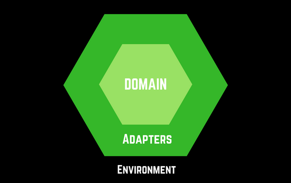

 

Have you ever worked with a truly tangled-up piece of code, mixing business logic with UI with database with http calls? Depressing, isn't it. Fortunately, there is a better way ...<!--more-->

## Building a Guess my Number game

I like to learn things with decent sized examples, so I'm going back in time to one of my earliest programs, Guess my Number.

This is a simple text game, where the computer picks a secret number between 1 and 10. You have to guess it, within five tries.

It's simple enough to code up quickly.

Better still for this example, it reads input from the keyboard, outputs to the console, and has a little bit of logic tying the two together.

Perfect.

So - what can possibly be a problem with something so simple?

## First design

So, ignoring [Test Driven Development](https://www.viewfromthecodeface.com/how-to-write-a-tdd-unit-test-with-java/) for a moment, let's go full on old-skool, and code this thing up.

Have a quick skim read, then we'll walk through it:

The **main** method is trivial. It creates a GuessMyNumber object, and supplies it with our secret number.

It then calls play() to run the game.

The code is short. It's reasonably clear and readable. And it works.

What's not to like?

## What if we want to display to somewhere else?

A console based game has a retro hipster appeal to it.

But what if we wanted to display to a GUI? Or maybe a simple web page?

How could we do it?

### We have to modify the code

To display to a GUI, we would have to rip out the innards of the display() method.

We would need it to write to a JTextArea - or something from JavaFX.

This would need main windows creating, and other modifications to the code.

It's not ideal.

We've built and manually tested this thing. Now we're going to invalidate that.

## How do we test this thing?

Come to mention testing, it has been all manual.

How _would_ you automate tests for this?

Well, the input must come from the keyboard. So you would need to drive that.

The output goes to the console. You would need to intercept that.

Whilst tools such as Mercury WinRunner will do this (and Selenium for Web Apps), testing through the User Interface is no fun.

UI tests tend to be slow, and a bit 'flaky'. Sometimes, screen updates are missed, and tests fail wrongly. 'False negatives' as they are known.

## Fixing this so we can change and test easily

The big problem with changing the input and output sources is _also_ the problem with testing.

If we could change the input and output sources easily, then we could write a unit test using stubs.

Stubs are simple Java objects that let us 'pretend' to be the real objects:

- We can simulate key strokes in Java, without messing around with the real keyboard
- We can simulate a console - and capture the program output as simple Java strings.

Using these ideas, we can write a fast, not-flaky Unit Test.

## Unit tests and Dependency Inversion

Our program's real problem is that it _depends on_ the System.scanner for input and System.out.println for output.

Our code creates and uses the objects directly.

What if we turned that upside down?

What if we made the code so that it _didn't_ depend on these objects, but instead, provide a way to plug them in later?

**This trick is called** **_dependency inversion_**.

## Second design - using Dependency Inversion

Have a look at this. More code - yes. But better.

Pay attention to:

- interface **Guesses** - the source of input
- interface **Display** - where we send text output
- how **main()** 'wires up' the input and output
- **HexagonalGuessMyNumber constructor** - look at those parameters

In the above HexagonalGuessMyNumber class, the constructor takes our secret number still - but with two new parameters.

These are our inverted dependencies.

The first one, Guesses, is an interface.

This is the contract defining the way we get input from the user.

_But not how it is done_.

This is left to the concrete implementing class KeyboardGuesses.

As you would expect, this contains the System.scanner code from our previous example. It is a simple refactor.

### Easy to create new input and output classes

The significance of this is that HexagonalGuessMyNumber knows _nothing_ about where the guesses come from.

You could write many different implementing classes - WebGuesses, CsvFileGuesses and so on - provided they implement the interface.

Significantly, for Unit Testing, we can write StubGuesses.

This is a simple Java class which allows us to define what simulated keyboard input to supply next. Then we can assert against that.

Doing this takes the mechanical keyboard - and the human player - out of the equation.

### Main chooses which one to use

The next key feature is our main() method.

We create the HexagonalGuessMyNumber object here.

We _also_ create the precise Guesses and Display instances we want to use.

It is here that we can change our minds about where the game reads its guesses from, and where it sends output to.

And the game object itself does not have to change. An application of the OpenClosed Principle (OCP).

Creating the objects here and passing them in is called **Dependency Injection**.

### Injection - Inversion: Two sides of the same coin

You may have seen the terms Dependency Injection and Dependency Inversion used interchangeably.

This is not quite right.

You always see the two go together, but:

- **Dependency Inversion** is the design decision to take dependencies out of a class
- **Dependency Injection** is how we create those dependencies then pass them in

## The three layers of this system

Let's consider the path that some text output takes:

- The application's core logic (HexagonalGuessMyNumber) decides on what text to output
- This is then transformed into a suitable form (ConsoleDisplay)
- This touches the external environment (a Console Window)

If you consider the path of a number being entered at the keyboard, it's the same thing.

The external environment (physical keyboard) gets transformed (KeyboardGuesses) into something usable by the core logic.

In general terms, we call these three layers

- External environment
- Adapters
- Domain

Outside, the external environment lies outside our application.

It is the operating system calls, the file system, the display and networking technology, our SQL and NoSQL databases.

Inside, we have our core application logic - the domain model.

This is technology free. It is all about the core rules that makes our application what it is.

To bridge the gap, we must adapt between the two: our adapter layer.

Each adapter contains code that is tightly coupled to the external environment. But it adapts it into a domain-only form. KeyboardGuesses knows all about reading physical keyboards. But it then adapts it into the domain interface Guesses. This uses only String - a technology-independent way to represent user input.

### Abstracting the real world - Service Interfaces

It's worth noting that everything in the external environment that we need to access, we do via an interface in the **domain** layer.

These **service interfaces** are designed to use only other domain classes/interfaces, and primitive types.

They **never** refer to any code or convention in the adapter and environment layers.

By doing this, we completely isolate our domain layer from anything outside it.

It's the complete opposite of top-down procedural designs.

## So, why call it Hexagonal Architecture?

In our example above, we had two different kinds of dependency. One on an input source, and one on an output source.

But in real apps, we have many more:

- Database
- HTTP web server
- External Devices
- Removable Media
- Local Networks

If you draw a diagram with the domain objects in the middle, the external environment outside, and our adapter layer in the middle you get concentric shapes.

Like this:

 

The reason there are six sides is simply a graphical nicety.

You can draw out hexagonal architecture blanks on paper, and six faces is usually enough to model your whole system. Think of each face as being one aspect of the outside world: web, database, touch input.

## Guess my Number Architecture Diagram

The great advantage of designing like this is the technology-free core.

This makes it easy to reason about what the app does, easy to unit test, and easy to adapt to changes in the outside world later.

Even for small projects, hexagonal architecture usually pays off.

## Get the code

Get the source files [on GitHub](https://github.com/viewfromthecodeface/HexagonalGuessMyNumber)
