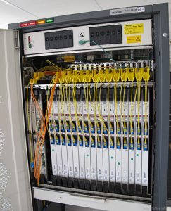
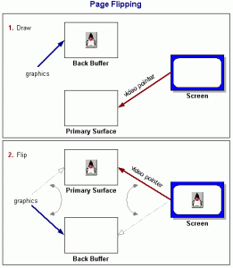

At my first job, a simple request on a spec led to a really hard problem to solve. How do you get data out of a machine more quickly than you can produce it?

This is how a bit of team work combined three disciplines to find a solution.

## At the end of your phone line is glass

Ever wondered what you would see if you travelled inside your telephone, down the phone line, and into the local exchange?

It is a fascinating world, telecoms.

Modern exchanges deal in one thing: Optical Fibre. And lots of it.

To get the bandwidth needed to support all of our Netflix, and Snapchat and even voice  calls - gasp! - to friends, telecoms uses optical fibre to carry the signals.

And this means we need a way to link in the analogue electronics of a landline into fibre.

## That glass connects to one of these

(photo: By Vivien Guéant - Image importée du reportage Visite du siège et des infrastructures techniques de CityPlay à Amiens de Lafibre.info, CC BY-SA 3.0, https://commons.wikimedia.org/w/index.php?curid=29702164)

My first job at Siemens was to code the help text, using the C language, for a piece of telecoms equipment which did just that. A classic first job for a junior engineer.

The Siemens Optical Line Termination Equipment was a rugged, high end bit of kit that you plugged fibres into. It looked similar to the one in the photo, made by Alcatel.

The interesting part, as I progressed and got further into the project, was **monitoring**.

## Measuring performance - quickly

A key part of this kit is knowing it is working right, and diagnosing faults quickly when it isn't.

To do this, we needed to implement an on-demand view of the latest monitoring data. The key indicator is the Bit Error Rate (BER). This describes how frequently a bit of data is unreadable. Once the BER hits a certain threshold, you know something, somewhere needs replacing.

The monitoring data was well specified in the [G.721 standard](https://en.wikipedia.org/wiki/G.726), and was reasonably straightforward to implement.

The challenge was speed. **We had 500 microseconds to deliver it**

## What do you do when it's too slow?

Whlst this was a perfectly reasonably requirement in the spec, it was hard to achieve.

The idea was that a central engineer's laptop would poll all of the termination units, and give an answer immediately. Being able to poll them in sequence, very quickly, simplified the software you needed on the laptop.

Our first attempt was to write the G.721 statistics calculations based on latest data as soon as the request landed.

It was _much_ too slow. Not within any kind of 'optimise the code' kind of thinking.

We needed a different approach.

So we put out heads together as a team. What else could we do, if we were not able to generate the data on request?

### Cache the results

First idea was to cache the results: Don't generate the data when we are asked for it, pre-generate it.

We could use a background thread to compute a 'latest snapshot' of this data, and store it in RAM, where it is fast to deliver.

This solved our 'too slow to generate problem'.

It meant that, worst-case, our statistics might be a few minutes out of date. But this was ok. The spec did not mention how fresh the data needed to be. Obviously, "as fresh as possible", but this gave us the opportunity to cache a snapshot.

Good - but not good enough.

### Use the non-maskable interrupt

We still could not guarantee delivery within 500 microseconds.

We had the data ready, but the way we had set up our Real Time Operating System (RTOS) meant that we couldn't interrupt its highest priority tasks soon enough.

One of those decisions that you might do differently if you did it again. But here we are.

We chose the slightly out-of-the-box idea of using the non maskable interrupt of the CPU. This would bypass the RTOS completely.

These things are interrupts at the lowest hardware level.

Whilst our RTOS would handle normal interrupts, in a methodical and ordered way, the NMI just leaps in, and interrupts the RTOS itself.

Unconventional. But this gave us our sub-500 microsecond response of the latest data.

Job done?

Not quite.

### Use double buffering - like in graphics applications

Because our RTOS was not in control at this point, we had to be careful about concurrency.

What would happen if the NMI came in, and sent out the snapshot data _whilst we were half way through generating it?_

This is the classic multi threading error.

Best case, the data would be 'not right'. Worst case, and quite typically, the data sent is entirely corrupted.

Normally, you would use an RTOS **mutex** for this.

The calculating code would acquire a lock, so that any read attempts had to wait until it was finished.

But we couldn't do that here; we had decided to bypass our RTOS to get raw speed.

So, we recalled our days in home computer gaming which has a similar problem: screen flicker. And we remembered how flicker was solved - using double buffering.

### How double buffering solves problems like this

\[caption id="attachment\_166" align="alignleft" width="261"\] How double buffering with pointer swapping works (from Java tutorials)\[/caption\]

A game is an animation. Every 50th of  a second (or faster, now) the entire screen is updated with all the graphics in the latest places.

Since the last frame, a lot of that data has changed: missiles move, mario jumps, the rally car skids.

Old games would have a problem where the new data was written to the same 'screen buffer' as the previous frame.

Inevitably, the screen update would happen as the game was half way through its calculations.

The result was torn lines, weird flashes of colour and a flickering of objects, as they vanished for 1/50th of a second.

The problem here is that you really need to write the next frame in 'fresh memory'. You update the screen from a different memory set. Then you swap over.

This way. the screen update only ever happens from memory that isn't being changed.

### Adding two G.721 statistics buffers

So that's what we did.

We allocated twice the RAM needed for one set of G.721 data.

We set a C "write" pointer to the first area, and prefilled that at app startup.

We then 'swapped over' buffers: We set a C "read" pointer to this first area, and moved the write pointer to the second area.

Over the next few minutes, data would be collected, and this second 'write' area would be updated.

Any NMI read requests coming in would send out data from the first 'read' area.

As soon as the 'write' area data was finished, we would swap these pointers over.

To prevent corruption due to the swap, we used an atomic 'exchange' kind of operation to flip the pointers over.

 

## In Retrospect

This was one of my earliest examples of a team being able to solve an 'impossible' problem, by talking, and mixing up several ideas from different backgrounds.

Electronics-level CPU knowledge, games programming, and a bit of Computer Science fundamentals all combined to get a result.
