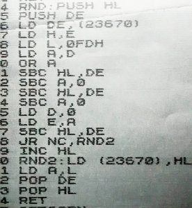
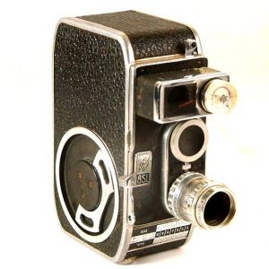
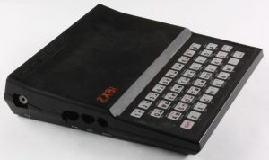
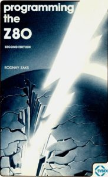
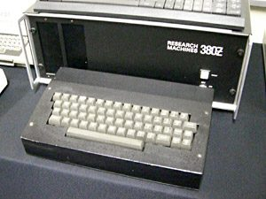
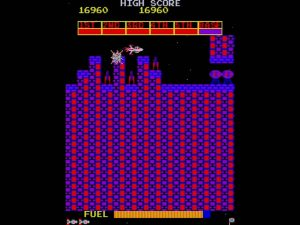

It's not every day you open up your "desk drawer of things you should throw out", and get a reminder of where it all started!

## Space Invaders and Random Numbers

My programming all started in response to Space Invaders. And this was the piece of code that really opened up programming to me.

This one here.

It is a [Pseudo Random Number Generator](https://en.wikipedia.org/wiki/Pseudorandom_number_generator) (PRNG) written in Z80 assembler.

You make a call to the function RND, and you will get a 16 bit random number the HL registers, along with the lower bits in A, just as a convenience.

It works out (k \* seed mod 65537 + r), generating a sequence of numbers that apparently have no connection to each other.

It is as if they were picked from a hat _at random_.

But why would such an obscure piece of mathematics have caught this 14 year old's attention?

## Morph

Before computing, I had a go at amusing myself trying to re-create my favourite cartoon character, Morph.

Morph was (and is!) a plasticine model about six inches high, who is the central character of some animated clips.

They were shown on the BBC show Take Hart, and I thought they were fab.

 

Me being me, I decided to have a go at making my own copy.

So, I set myself up with:

- A table
- A lump of plasticine
- A 500 watt light
- A tripod
- A Bolex B8SL 8mm movie camera
- A cable release

After making some very primitive plasticine models, and persuading a more talented friend (props to Duncan!) to draw some backgrounds, I made my first test films.

It's a slow, but quite satisying process.

Position the models. Click click.

Make small moves on the models. Click Click.

Shooting two frames of film each move meant I could get away with an effective frame rate of 8 FPS. Eight separate movements added up to one second of movie.

## Turns out it's a skill

My first attempts (and even my later attempts) would never set the world alight.

As a winging-it animator, my movements were too fast, too large, too jerky.

There was no characterisation or emotion.

I had no plot to speak of.

The animations were _bad_.

But I was proud of them: people told me I couldn't do it, I was too young, Disney employs thousands of people, yadda yadda.

(Ever seen what happens when you tell me I can't do something? Yep. That.) But I just wanted to see what I could do.

And I learned that Nick Park's job was safe. I would never be a great animator.

But I'd had _fun_.

## What's this cabinet in the pub, dad?

Space Invaders came as a real surprise to me.

I was at a Sunday Lunch with my family in a pub, a rare treat out. There was quite a commotion in the corner.

Space Invaders. Coin Op. Lots of people stood around it.

I looked at others playing it.

It was \*so\* exciting to me. This was something fun.

It was an animation - _but you could change the script in real time!_

So, how did it work?

and ... _can I make one?_

## Clive Sinclair takes over my TV

Museums Victoria https://collections.museumvictoria.com.au/items/1400135

After a lot of saving up (£70 was a \*lot\* of money), I was able to get hold of a Sinclair ZX81, the wondrous beast in the picture.

It had an 8 bit CPU, the Z80A, which was clocked at 3.5 MHz.

As the CPU drove the display, about 75% of those cycles actually went to running your program.

 

To back this up, the ZX81 sported a full 1k (one kilobyte) of RAM.

This RAM had to:

- Store the program code
- Store the program data
- Act as the display video memory
- Hold any tools, like an assembler or compiler

All at the same time.

To see what you were doing, you plugged it into the aerial socket of a television set.

I was hooked immediately.

## Learning BASIC

Whilst developed as a teaching language at Dartmouth College in 1965, BASIC (Beginners All Purpose Symbolic instruction Code) took the 1980s by storm.

All home computers came pre-loaded with the BASIC language.

Instead of an Operating System, like MacOS, Ubuntu or Windows 10, you turned on a computer, and were greeted with a BASIC copyright statement, and a cursor where you could type your BASIC statements.

\[code language="basic"\]

10 PRINT "Hello! This is Al's computer!"

20 GOTO 10

\[/code\]

The excellent self-learning ZX81 Manual covered BASIC very well. How to use variables, if statements and for loops was all made clear, even to this 12 year old.

## Sir Clive's nod to games programmers

The Zx81 featured two BASIC instructions critical to games programming:

- **INKEY$** which read a character from the keyboard without pausing the program
- **PRINT AT x,y;** which allowed you to place a character anywhere on screen at the (x, y) coordinates

Combined, it wasn't too hard to make a very simple loop that moved a 'laser base' around:

\[code language="basic"\]

10 LET X = 12;

20 LET K$ = INKEY$;

30 IF K$="Q" THEN END;

40 IF K$="O" AND X>0 THEN LET X=X-1;

50 IF K$="P" AND X<27 THEN LET X=X+1;

60 PRINT AT X, 22; " <A> ";

70 GOTO 20

\[/code\]

This simple code runs until you press the 'Q' key at which point it stops.

Pressing the O key moves the base to the left. Pressing P moves it to the right.

The AND clauses stop you falling off the side of the screen.

The PRINT AT statement draws cute 80s ASCII art to depict a laser base.

The two spaces at each side of the laser base are technical, and erase 'trails' from the previous frame, crudely.

It's not much of a program.

But to this 12 year old, it was _pure magic_; I had replicated that big, expensive Arcade game in my bedroom, at least a bit. I could move a laser base left and right.

## Making better games

BASIC, it turned out, was too slow to make any decent games.

Moving one laser base was ok. But once we added obstacles, missiles, enemy space ships - if you can call <O> that - things ground to a halt.

Enter **Assembly language**

As the ZX81 was based on the Z80 CPU, this meant you could bypass the slowly interpreted BASIC language entirely.

You could code in machine language.

I learned this from the book pictured, intended for graduate level microprocessor engineers. Thankfully, some magazines of the day covered some of the background as well.

## Coding games in assembler in 1982

You would start by deciding which Z80 instructions you needed to make the program work.

And these would be very many, as assembly is very low level.

You would write down these instructions by hand on a piece of paper.

You would translate them into their equivalent hex codes, by looking up the opcodes in the back of the ZX81 manual (or the Zaks book, pictured), and working out relative jump addresses by hand.

The ZX81 could then have a simple hex loader BASIC program typed in, that allowed you to type in these hex codes, one at a time.

Using the BASIC command 'USR' - meaning 'run user written machine code program' - you could launch a blisteringly fast game.

Sometimes.

In the beginning, you would have made a simple mistake - say typed "B9" when you should have typed "B0", and the whole machine would crash.

You would lose all your work.

But when it did work ... it was magic.

Games, with their lovely ASCII art, that ran as fast as the arcade versions.

## So, where does that code come in?

The original code is a piece of Z80 assembler that generates random numbers. Each time you call it, a new number is returned. Each number in the sequence is hard to predict. It has no obvious relation to the one before it.

This is brilliant in games.

It means the game code can decide what to do with some randomness. Enemy spaceships - our <O>, remember? - can suddenly decide to fly in a different direction. This turns the player's actions into more of a game of skill, than just learning patterns.

I got this Z80 code from Personal Computer World magazine, if I recall right.

And I was so grateful.

I had tried to guess my way to a random number generator.

Not knowing the maths behind the Mersenne twister, and 'maximal length sequences', I had no chance.

My test set up involved calling the random function twice, and using the values to print a square on screen at those coordinates.

Everything I tried had a very obvious, visible pattern to it.

Until the day I plugged in the code above.

It was amazing.

Squares appeared around the screen - and I couldn't gaze in the right place to catch them appear anymore.

## That was my start

By this time, I now had all the tools I needed to make my simple games:

- Could hand code Z80 assembler
- Could enter it using a hex loader
- Understood how to read the keyboard and print at a position on screen, but in assembler
- Understood animation, and movement, and variables
- Had the raw speed to make arcade games

I ended up making a cute side-scrolling racing game in a 10 x 10 grid on my 1k ZX81.

It used the random generator to create the road and obstacles. I found I could ask for a 'game number' to be entered, between 0 and 65535.

By using this to 'seed' the random sequence, I got 65 thousand repeatable different game maps stored in 1k of RAM.

An early example of using a 'generator function' as data compression, a technique I could draw in later.

## And then I got banned from the school computer lab ...

Because I then went on to build an ASCII art 'Scramble' game clone on the school RML 380Z computers.

This had five stages of a side scrolling spaceship, that shot at enemies which flew towards it, and drop bombs on military targets on the ground.

It was a copy of the fabulous Scramble coin-op arcade game.

I had to do this at school, as the RML 380z computers had enough RAM to fit it all in.

It went 'viral'.

 

Every break time, the lab would fill up with kids playing this game. All break. Every computer. For weeks on end.

Unfortunately, the RML380Z had a keyboard buffer, which only reloaded when you released the key.

So all the kids were mashing the up and down keys of the game, very quickly.

In a few short weeks, the keyboards started failing.

The computing teacher, err, _informed me_ (he was none too pleased) that each keyboard cost £75 to repair. Money that the school did not have.

And so with immediate effect, I became a geek legend: All kids, the game disk itself, and me were banned from the computer lab!
